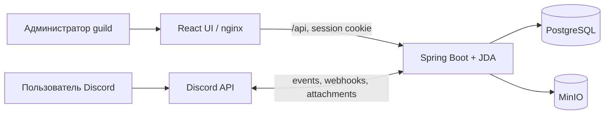
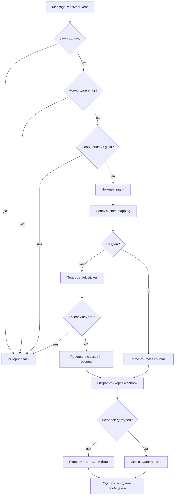

# Архитектура

Bigmoji состоит из четырёх runtime-сервисов: backend/Discord bot, web UI, PostgreSQL и MinIO.

## Backend

Основные пакеты:

| Пакет | Назначение |
|---|---|
| `api` | REST-контроллеры, DTO и единый формат ошибок |
| `auth` | Discord OAuth2, signed cookie session и guild authorization |
| `discord` | JDA listener, webhook-отправка, custom emoji metadata |
| `emoji` | распознавание и нормализация emoji |
| `sticker` | выбор маппинга, fallback-каталог и cache |
| `storage` | загрузка и чтение файлов из MinIO |
| `domain` | JPA entity и repository |
| `config` | JDA, MinIO, async executor, MVC и health |

`EmojiMessageListener` обрабатывает события асинхронно через `messageExecutor`. Поиск выполняется по ключу `{guildId, normalizedEmoji}`. Пользовательские маппинги имеют приоритет над встроенными.

## Поток замены

## Данные

Таблица `sticker_mapping` хранит:

| Поле | Тип | Назначение |
|---|---|---|
| `id` | UUID | идентификатор маппинга |
| `guild_id` | VARCHAR(32) | Discord guild |
| `emoji_name` | VARCHAR(64) | Unicode emoji, shortcode или custom emoji |
| `minio_bucket_name` | VARCHAR(128) | bucket вида `bigmoji-{guildId}` |
| `minio_object_key` | VARCHAR(256) | UUID и расширение файла |
| `created_at`, `updated_at` | timestamp | аудит времени |

Индексы по `(guild_id, emoji_name)` и `guild_id` ускоряют обработку сообщений и выдачу списка. Встроенные стикеры и auth session в БД не сохраняются.

## Web UI

React-приложение использует маршруты `/`, `/app` и `/app/guilds/:guildId`. В production nginx раздаёт SPA и проксирует `/api/` на `BIGMOJI_BACKEND_URL`, поэтому OAuth cookie остаётся same-origin для браузера. UI не имеет прямого доступа к PostgreSQL, MinIO или bot token.

## Авторизация

Discord OAuth2 запрашивает `identify guilds`. Backend формирует подписанную HttpOnly cookie `bigmoji_session`, содержащую пользователя, срок действия и список управляемых guild. Каждый API-запрос повторно проверяется по этому списку; переданный клиентом `guildId` сам по себе не считается доверенным.
